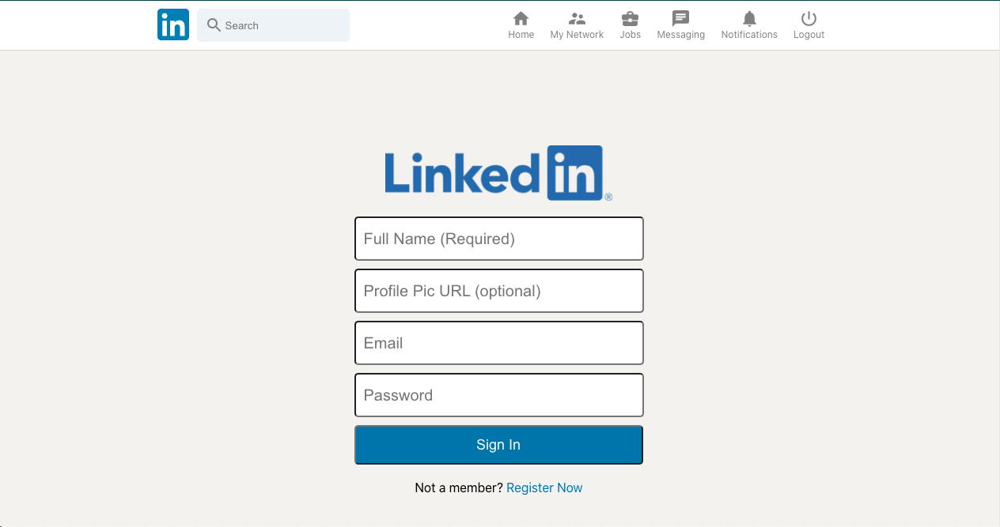
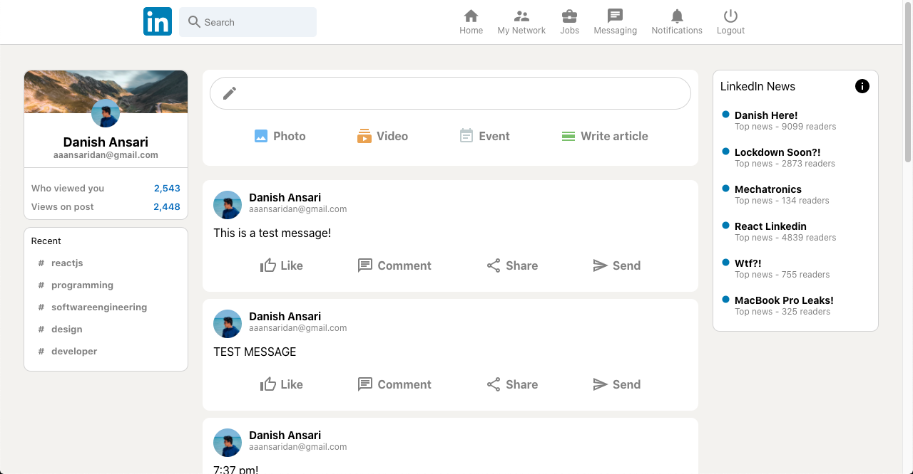

# LinkedIn Clone 

 

A fully functional LinkedIn clone made using

* `React` (FrontEnd)
* `Redux`
* `Material UI`
* `Firebase` (BackEnd)

 

---
You can view this web app in real-time [here](https://linkedin-clone-667e9.web.app/). 

---

### Preview
 

Login Page: 

  

 

Main App: 

  

 

---

 

Check out my <a href="https://danishansari.dev/">website</a>.

 

---

<b>Enjoy!</b>

---
